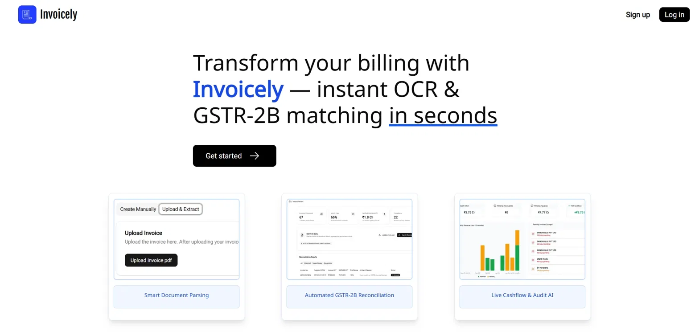
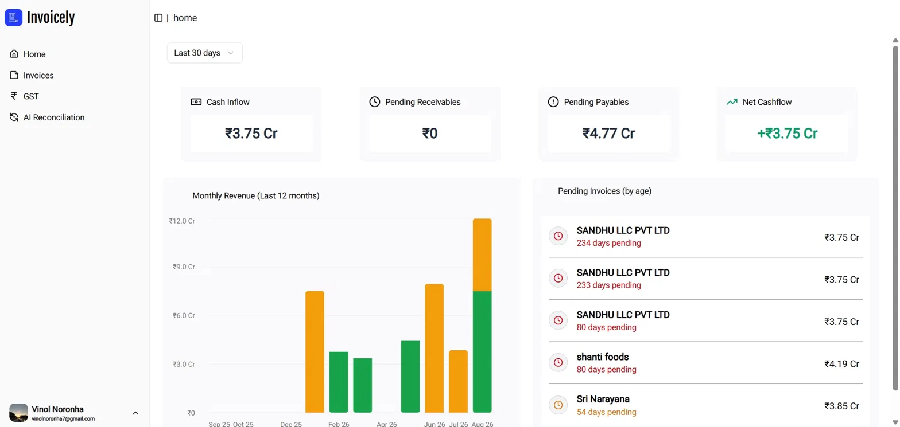
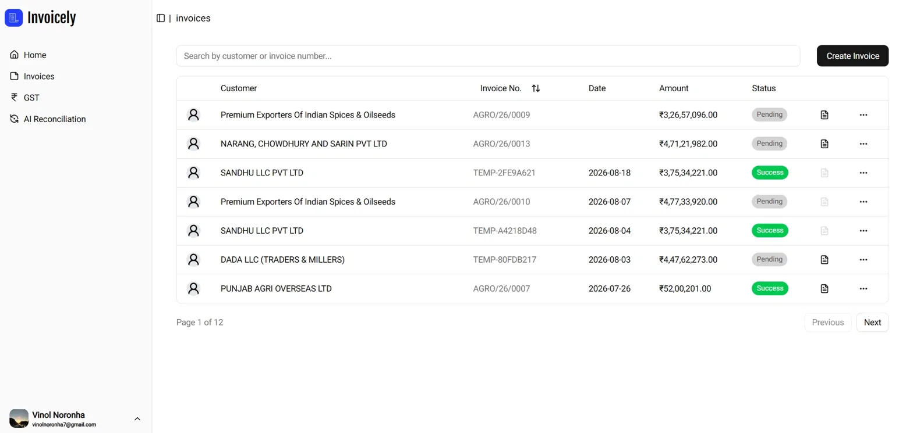
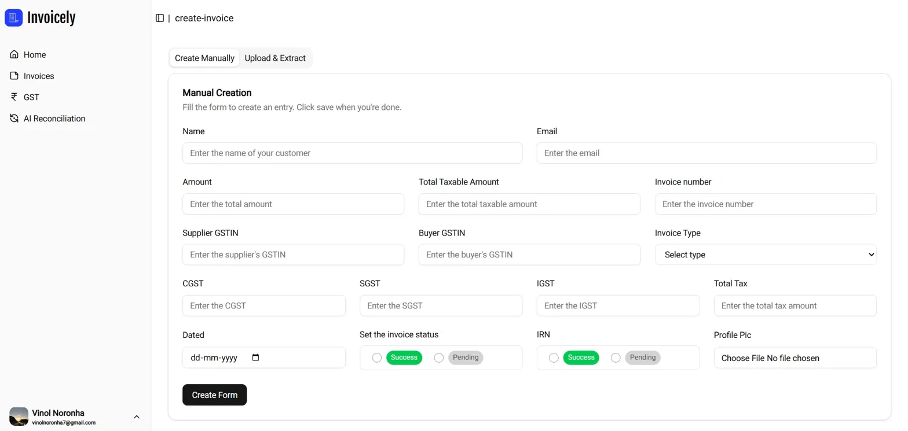
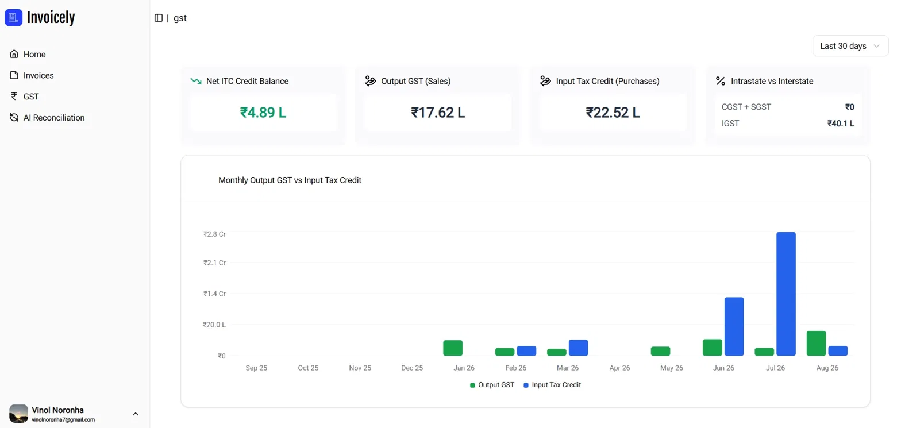
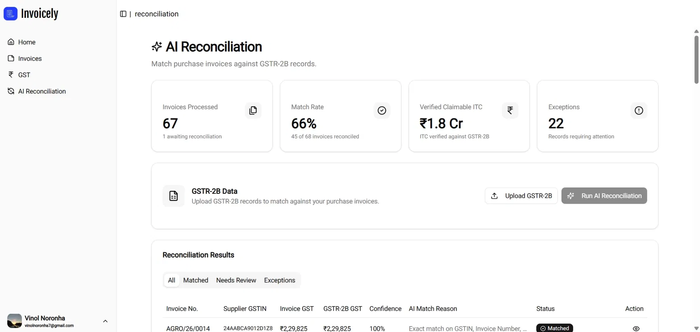
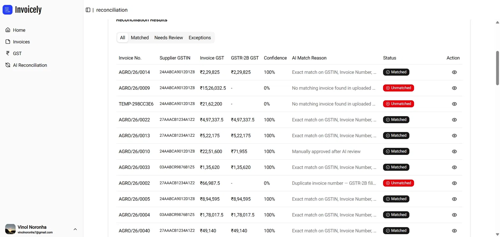

# Invoicely — AI-Powered Invoice & GST Reconciliation

A full-stack invoice management application with an AI reconciliation engine that matches purchase invoices against GSTR-2B records, explains discrepancies, and keeps a human in the loop on every exception. Built with Next.js, FastAPI, and Supabase.

**Live app:** https://invoicely-pi.vercel.app/
**API docs:** https://invoicely-backend-yixi.onrender.com/docs
**Repo:** https://github.com/VinolNoronha/invoicely

> Built for the Razorpay Build-a-thon — Track 04: AI Finance Controller.

---

## Screenshots

| Landing                                | Login                              | Home                                       |
| -------------------------------------- | ---------------------------------- | ------------------------------------------ |
|  |  |  |

| Invoices                                      | Create Invoice                                       | Upload & Extract                                       |
| --------------------------------------------- | ---------------------------------------------------- | ------------------------------------------------------ |
|  |  |  |

| GST Dashboard                            | AI Reconciliation                                          | Reconciliation Results                                               |
| ---------------------------------------- | ---------------------------------------------------------- | -------------------------------------------------------------------- |
|  |  |  |

---

## Features

- **Google OAuth Login** — Supabase Auth handles sign-in and session management, with per-user data isolation
- **Invoice CRUD** — Create manually or upload a PDF and extract fields automatically
- **PDF OCR Pipeline** — Coordinate-based spatial parsing (PyMuPDF) with anchor-based metadata search, a dedicated table extractor, and a tax extractor module
- **Duplicate Protection** — SHA-256 hashing on uploaded PDFs prevents re-processing the same invoice twice
- **AI GST Reconciliation** — Upload a GSTR-2B file and match it against purchase invoices on GSTIN, Invoice Number, Taxable Value, and Tax Amounts using fuzzy matching
- **Delta Tax Calculation** — Flags exact matches, tax mismatches, and unmatched records with the specific amount delta
- **AI Anomaly Engine** — For flagged discrepancies, a Gemini-backed agent explains the likely root cause and a suggested fix
- **Human-in-the-Loop Approval** — AI never auto-resolves a discrepancy; a human reviews the AI's explanation and marks the record Matched or Unmatched
- **Match Rate & Exception Reporting** — Dashboard KPIs for invoices processed, match rate, verified claimable ITC, and open exceptions
- **Analytics Dashboard** — Real-time cash inflow, pending receivables/payables, net cashflow, monthly revenue, and pending-invoice aging
- **GST Dashboard** — Net ITC credit balance, output GST, input tax credit, and intrastate vs. interstate tax split

---

## Tech Stack

| Layer                     | Technology                                                                   |
| :------------------------ | :--------------------------------------------------------------------------- |
| **Frontend**              | Next.js 15 (App Router), React, TypeScript, TailwindCSS                      |
| **Backend**               | FastAPI, Python 3.11 / 3.12, Uvicorn                                         |
| **Database & Auth**       | Supabase (PostgreSQL), Supabase Auth (Google OAuth)                          |
| **Storage**               | Supabase Storage (`invoice-pdfs` private bucket)                             |
| **OCR & Parsing**         | PyMuPDF (coordinate-based spatial parsing & bounding box extraction), Regex  |
| **Reconciliation Engine** | Python (FuzzyWuzzy / RapidFuzz string matching, Delta Tax calculation logic) |
| **AI / LLM**              | Google Gemini API (Discrepancy Root-Cause Analysis)                          |
| **Deployment**            | Vercel (Frontend), Render (Backend)                                          |

---

## Architecture

```
Browser
  |
  |── Next.js Frontend (Vercel)
  |     |── Supabase Auth client — Google OAuth login/session
  |     └── Dashboard — Home, Invoices, GST, AI Reconciliation
  |
  |── FastAPI Backend (Render)
  |     |── api/invoices.py — invoice CRUD endpoints
  |     |── services/pdfparser, anchor_search, table_extractor, tax_extractor — OCR pipeline
  |     |── GST reconciliation engine — fuzzy matching + delta tax calculation
  |     └── Gemini client — discrepancy root-cause explanation
  |
  └── Supabase (PostgreSQL)
        |── Invoices table
        |── Company table
        └── Auth (Google OAuth)
```

---

## Prerequisites

- [Node.js](https://nodejs.org/) v18.x or v20.x
- Python 3.11 or 3.12
- A Supabase project (URL + anon key + service role key)
- Google OAuth configured as a provider in Supabase Auth
- A Gemini API key

No Docker required — everything runs with a standard clone → install → run flow.

---

## Setup & Running

### 1. Clone the repository

```bash
git clone https://github.com/VinolNoronha/invoicely.git
cd invoicely
```

### 2. Backend setup

```bash
cd backend
pip install -r requirements.txt
```

Create a `.env` file in `backend/`:

```
SUPABASE_URL=
SUPABASE_SERVICE_ROLE_KEY=
GEMINI_API_KEY=
USE_MOCK_LLM=false
FASTAPI_BASE_URL=http://localhost:8000
```

Run it:

```bash
fastapi dev app/main.py
```

### 3. Frontend setup

```bash
cd frontend
npm install
```

Create a `.env.local` file in `frontend/`:

```
NEXT_PUBLIC_SUPABASE_URL=
NEXT_PUBLIC_SUPABASE_ANON_KEY=
NEXT_PUBLIC_BACKEND_URL=http://localhost:8000
```

Run it:

```bash
npm run dev
```

### 4. Open the app

Go to [http://localhost:3000](http://localhost:3000)

> Sign-in is Google OAuth only — there's no email/password fallback.

---

## Usage

1. **Login** — Sign in with Google via Supabase Auth
2. **Add invoices** — Create manually, or upload a PDF under "Upload & Extract" for automatic field extraction
3. **Track invoices** — View, search, and filter invoices from the Invoices page
4. **Reconcile GST** — Upload a GSTR-2B file, run AI Reconciliation, and review flagged records under "Needs Review"
5. **Resolve exceptions** — For a flagged invoice, trigger the AI explanation, read the suggested fix, and mark it Matched or Unmatched
6. **Check the numbers** — Home and GST dashboards show cash position, ITC balance, and pending invoice aging

---

Here is a updated, comprehensive README.md formatted to include the clean directory structure layout and tech breakdown you requested.

Markdown

---

## 📂 Project Structure

```text
invoicely/
├── frontend/                     # Next.js App Router Frontend
│   └── app/
│       └── dashboard/[id]/       # Dynamic Organization/User Dashboard
│           ├── home/             # Revenue & Key Analytics Overview
│           ├── invoices/         # Invoice Management & Table Views
│           │   ├── create-invoice/
│           │   └── _data-table/  # Modular Data Table Components
│           └── gst/              # GST Statistics & Reconciliation Views
│
├── backend/                      # FastAPI Python Service
│   └── app/
│       ├── api/                  # REST API Endpoints (Invoices, Reconciliation)
│       │   └── invoices.py
│       ├── core/                 # Core Connections (Supabase & External Clients)
│       │   └── supabase.py
│       ├── schemas/              # Pydantic Schemas & Data Validation
│       │   └── invoice.py
│       └── services/             # Core Extraction & Processing Engines
│           ├── anchor_search/    # Bounding-box & Field Anchor Search
│           ├── pdfparser/        # PyMuPDF Parsing Logic
│           ├── table_extractor/  # Line Item & Table Data Extraction
│           └── tax_extractor/    # Tax Code & GST Extraction Logic
│
└── README.md

> Folder names above are based on what's confirmed so far — adjust to match your actual tree before committing.

---

## Known Limitations

- Authentication is Google OAuth only (no email/password login)
- Match rate figures are reported against synthetic test data
```
